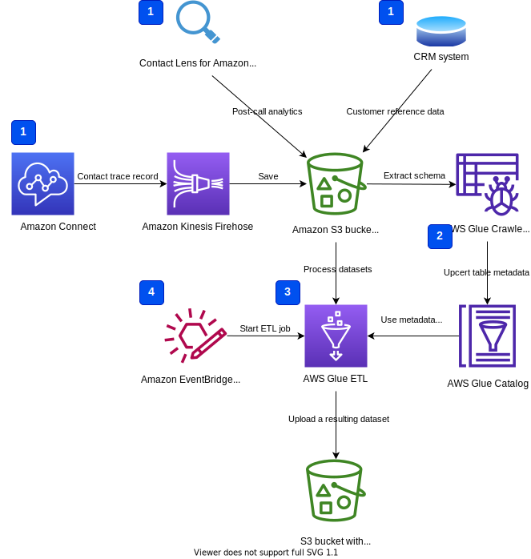
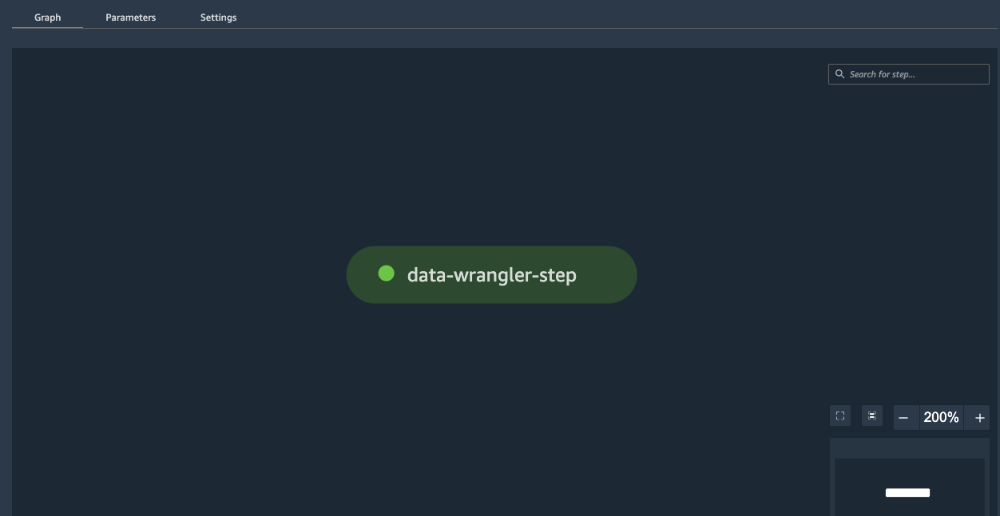
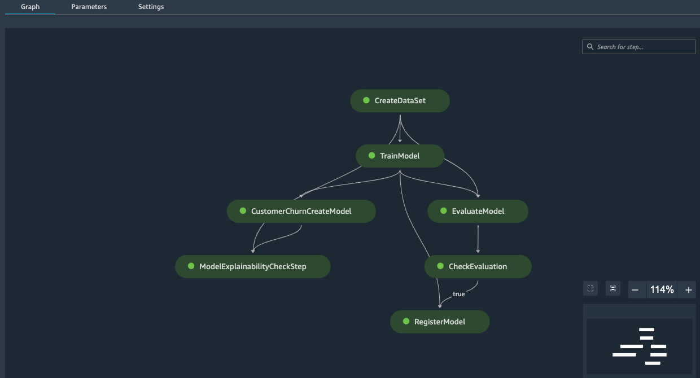

# Using AWS Glue and Amazon SageMaker Data Wrangler in MLOps pipeline for ML insights into your customer churn

This solution demonstrate a design pattern how to implement data preparation with a serverless AWS Glue ETL pipeline and Amazon SageMaker Data Wrangler in an end-to-end machine learning (ML) workflow. The focus is on automation and integration with upstream services like Amazon Simple Storage Service (S3), AWS Glue, and downstream ML services like Amazon SageMaker Feature Store, SageMaker model training, and SageMaker Model Registry.

The solution provides a hands-on example of the recommended practices for MLOps with SageMaker.  

## Use case
Amazon Connect and Contact Lens for Amazon Contact produce lot of valuable data about customer interaction with the call centre. We can use this data to train an ML model to implement business insights into customer behaviour, for example if a particular customer will churn. By integrating AWS analytical and ML services you can implement an automated ML pipeline

## Solution architecture


## AWS Glue ETL pipeline


**1 - Data sources**  
- Amazon Connect contact trace record (CTR)
- Contact Lens for Amazon Connect data
- Customer reference data

**2 - AWS Glue crawlers**  
Extract the meta data from S3 objects and store table schemas in AWS Glue Data Catalog

**3 - AWS Glue ETL**  
Implements an ETL pipeline

**Execution steps**

Step 1. Upload sample data to Amazon S3, please run the below command in a terminal at the cloned gitrepo base path:
```
$ bash setup/uploadFilesToS3.sh <s3 path>

e.g.
$ bash setup/uploadFilesToS3.sh s3://sample-test/connect-blog/
```
This `uploadFileToS3.sh` script will upload the sample data files to the specified S3 path and also the cloudformation template for the AWS Glue ETL job to S3. 

The output of this script will print the locations of different data files, for example:
```
#########################################################
 Files uploaded to following paths
CTR Data        = s3://sample-test/connect-blog/connect-ctr-data/
Contact Lens data    = s3://sample-test/connect-blog/contactlens-data/Voice/
Customer Reference data = s3://sample-test/connect-blog/customer-data/
Glue ETL Script     = s3://sample-test/connect-blog/glue-etl-script/connect-blog-aggregateCustomerSentimets.py
CF template       = s3://sample-test/connect-blog/cf_templates/connect-database-crawler-cftemplate.yaml
```

Step 2. Create a new Cloudformation Stack using the provided template `CF template`. When launching cloudformation stack , fill the parameters with the values from the above outputs. For example:
```
CFNS3ConnectDataPath : s3://sample-test/connect-blog/connect-ctr-data/
CFNS3ContactlensDataPath : s3://sample-test/connect-blog/contactlens-data/Voice/
CFNS3ConnectCustomerDataPath : s3://sample-test/connect-blog/customer-data/
CFNScriptLocation : s3://sample-test/connect-blog/glue-etl-script/connect-blog-aggregateCustomerSentimets.py
```

Once the Cloud formation stack is created successfully verify the resources have all been created. The CF template will create following resources in Glue:

> Glue databse with name `amazonconnect_db`

> Three crawlers :
- `cfn-crawler-connect-ctr-data`
- `cfn-crawler-contact-lens-data`
- `cfn-crawler-contact-lens-data`
  
> Glue ETL Job  with name "CFN-Aggregate-Customer-Sentiments" 

Step 3. Run all the three Glue crawlers, which will scan the files on s3 and create required tables for connect, contact lens and customer data.

Note down the newly created Table names. Edit the Glue ETL Script and update the values with following parameter:
```
connect_database = “amazonconnect_db”
connectCTR_table = “<Fill in with connect CTR table name>”
contactLense_table = “<Fill in with contact lens table name>”
connect_Customer_table = “<Fill in with customer data table name>”
output_path = “<specify the output path in S3>”
```

**To edit a script**

- Sign in to the AWS Management Console and open the AWS Glue console at https://console.aws.amazon.com/glue/.
- Then choose the *Jobs* tab.
- Choose a job in the list, then choose *Action*, *Edit script* to open the script editor.
- You can also access the script editor from the job details page. Choose the *Script* tab, and then choose *Edit script*.
  
Save and run the Glue ETL job.

Alternatively, you can use Amazon EventBridge to automate and schedule the ETL job to run on demmond.

**4 - Amazon EventBridge rules**
Starts an ETL job on schedule or on a particular event, for example, upload of a new CTR file in an Amazon S3 bucket

## Amazon SageMaker ML pipeline


### Data Wrangler processing and feature ingestion pipeline


### Model build pipeline


## Deployment

## Clean up

## Resources
- [Custom Project Template for SageMaker with GitHub and Jenkins](https://github.com/aws-samples/amazon-sagemaker-workshop-analytics-machine-learning/tree/main/5.%20MLOps%20SageMaker%20Project)
- [Operationalize a Machine Learning model with Amazon SageMaker Feature Store and Amazon SageMaker Data Wrangler Using CDK](https://github.com/aws-samples/amazon-sagemaker-mlops-with-featurestore-and-datawrangler)
- [Real-time Churn Prediction with Amazon Connect and Amazon SageMaker](https://github.com/aws-samples/real-time-churn-prediction-with-amazon-connect-and-amazon-sagemaker)

Copyright Amazon.com, Inc. or its affiliates. All Rights Reserved.
SPDX-License-Identifier: MIT-0


